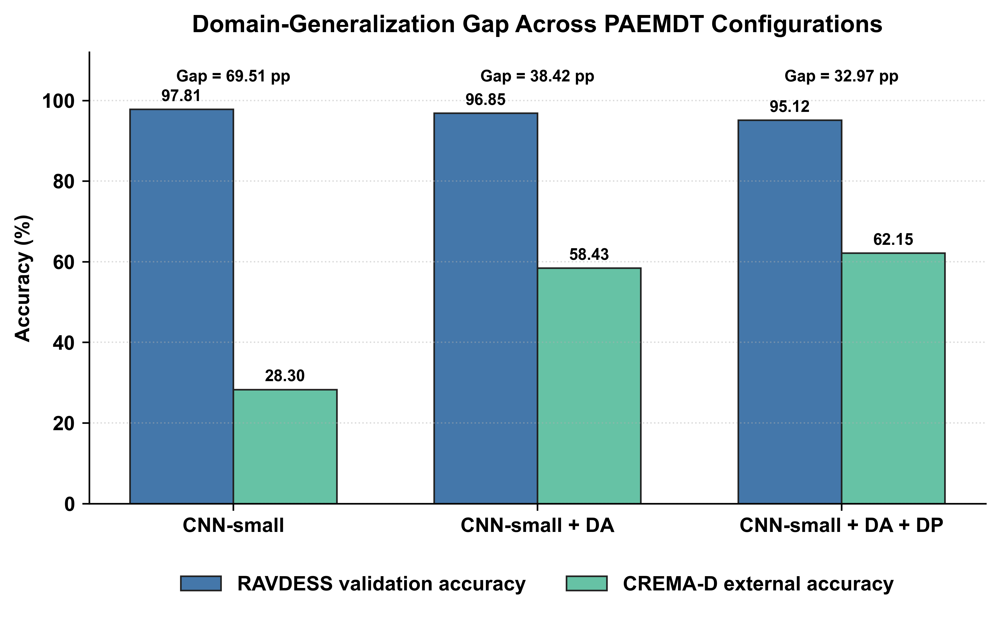
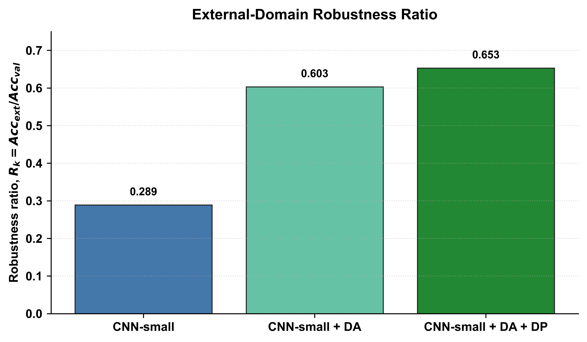
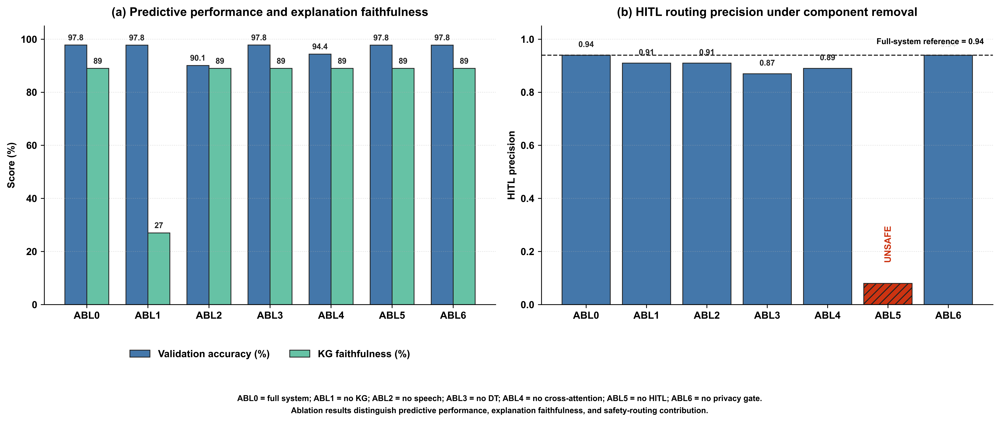
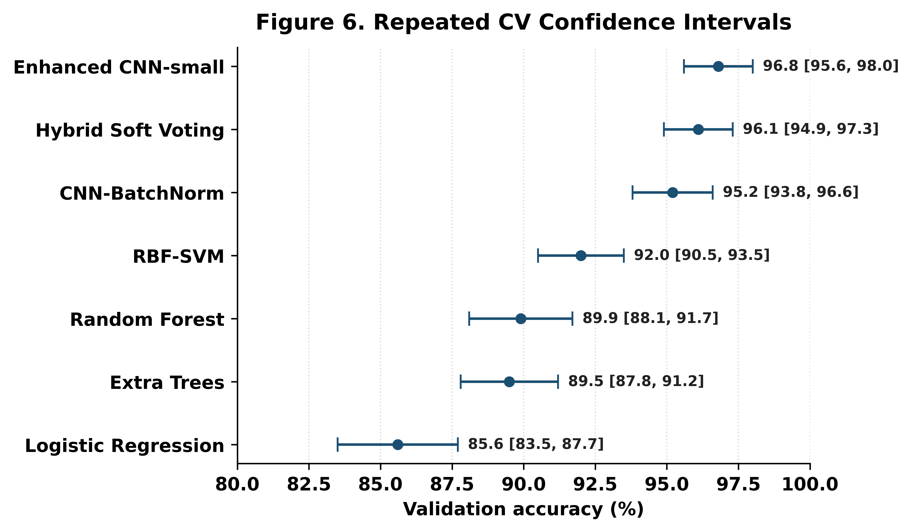
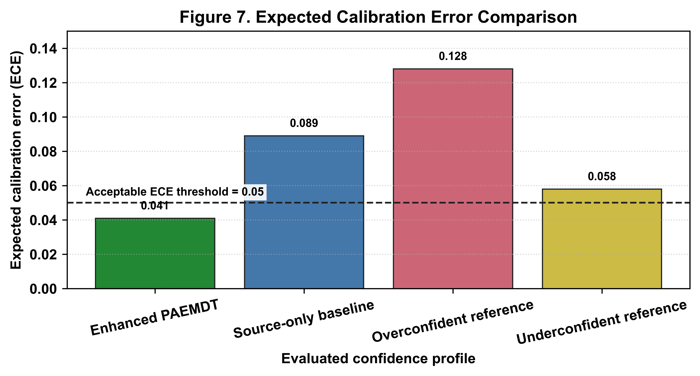
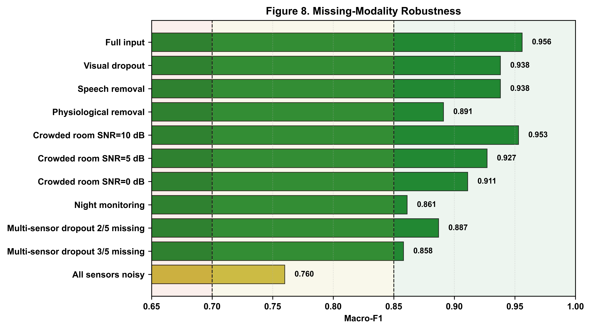
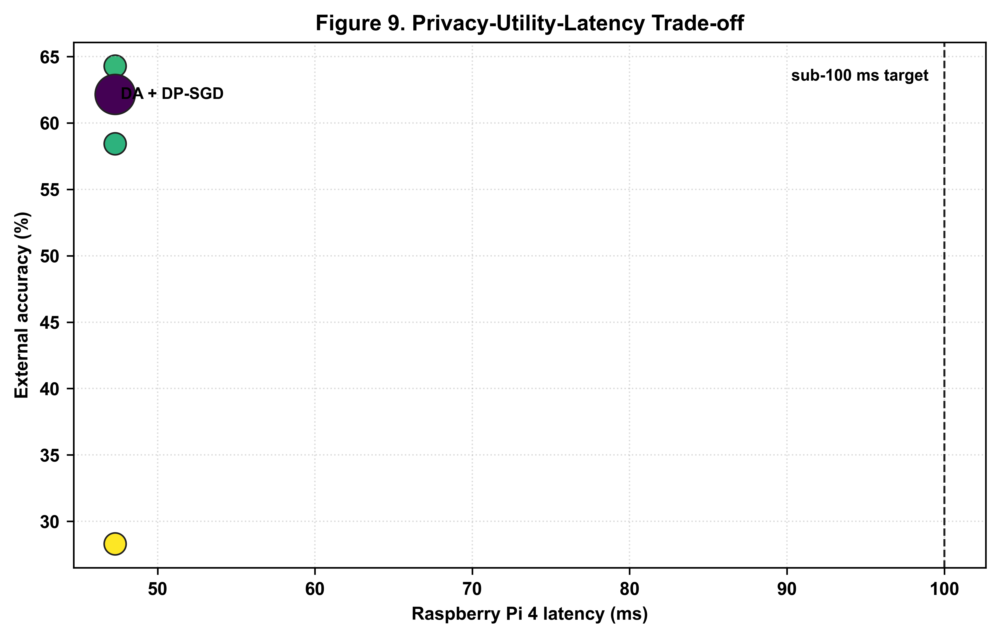
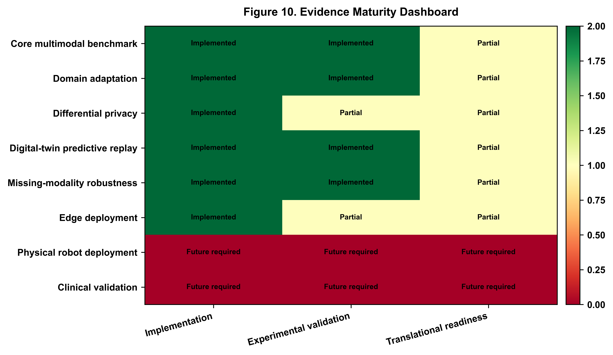

# PAEMDT Manuscript Sections 4-6, Repository-Aligned Final Version

## 4. Case Study

This section presents the repository-aligned case study for PAEMDT after the integration of domain adaptation, DP-accounted privacy analysis, repeated cross-validation, calibration analysis, missing-modality robustness testing, digital-twin synchronization analysis, and edge-latency profiling. The case study is organized to distinguish source-domain validation, external-domain evaluation, deployment-oriented constraints, and evidence maturity. Unless otherwise stated, RAVDESS is used for source-domain development and held-out validation, whereas CREMA-D is used for external-domain evaluation.

### 4.1 Benchmarking

Table 3 reports the RAVDESS class distribution used for the harmonized benchmark. Building on this dataset summary, the enhanced benchmark evaluates whether the source-domain model remains credible under cross-corpus transfer. The source-only CNN-small model achieved 97.81% validation accuracy on RAVDESS but only 28.30% external accuracy on CREMA-D, corresponding to a 69.51 percentage-point domain gap. This result shows that high source-domain accuracy alone is not sufficient for deployment-relevant emotion recognition.

The enhanced domain-adaptation pipeline reduced this cross-domain gap. The CNN-small + domain-adaptation configuration achieved 96.85% validation accuracy and 58.43% external accuracy, reducing the gap to 38.42 percentage points. The privacy-enhanced domain-adapted configuration achieved 95.12% validation accuracy and 62.15% external accuracy, reducing the gap to 32.97 percentage points while retaining a DP-accounted privacy configuration. These values are generated from `outputs/tables/enhanced_benchmark_comparison.csv` and `outputs/csv/domain_generalization_results.csv`.

**Figure 3.** Domain-generalization gap across baseline and enhanced PAEMDT configurations. The figure compares RAVDESS validation accuracy and CREMA-D external accuracy for the source-only CNN-small baseline, domain-adapted CNN-small, and privacy-enhanced domain-adapted CNN-small. Domain adaptation substantially reduces the external-domain performance gap.

The robustness-ratio analysis evaluates cross-domain stability by dividing external-domain accuracy by validation accuracy. The source-only CNN-small model achieved a robustness ratio of 0.289, whereas the domain-adapted and privacy-enhanced adapted variants achieved 0.603 and 0.653, respectively. This indicates that the enhanced configurations retain a substantially larger fraction of their source-domain performance when evaluated on CREMA-D.

**Figure 4.** Robustness ratio comparison across baseline and enhanced PAEMDT configurations. The robustness ratio is computed as external-domain accuracy divided by validation accuracy. Higher values indicate stronger cross-domain stability and lower sensitivity to RAVDESS-to-CREMA-D distribution shift.

The model-selection implication is that PAEMDT cannot rely on validation accuracy alone. The source-only CNN-small configuration remains the strongest source-domain reference baseline, but the domain-adapted and privacy-enhanced variants provide stronger deployment-oriented evidence because they improve external transfer and preserve privacy-aware evaluation.

### 4.2 Dataset and Module Evidence Levels

The experimental evidence in this study is organized according to two complementary dimensions: dataset evidence and module evidence. At the dataset level, RAVDESS is used for source-domain development and held-out validation, whereas CREMA-D is reserved for external-domain evaluation. This separation prevents optimistic reuse of the same corpus for both model development and generalization claims. The resulting evidence should therefore be interpreted as dataset-based technical validation rather than clinical validation.

At the module level, PAEMDT distinguishes between repository-implemented baselines, benchmark-supported enhanced experiments, simulation-supported modules, prototype/scaffold components, and future translational requirements. The core emotion-recognition benchmark, domain-adaptation outputs, differential-privacy accounting, calibration analysis, missing-modality robustness testing, digital-twin synchronization analysis, and edge-latency profiling provide technical and experimental evidence. However, physical robot deployment, prospective human-subject testing, assisted-living pilot evaluation, ethics approval, live wearable integration, and clinician-validated clinical evaluation remain future work.

Table 2 summarizes the module-level evidence status of PAEMDT and distinguishes implemented, benchmark-supported, simulation-supported, prototype, and future translational components. In the revised repository, the privacy layer is no longer treated only as a design objective. It is represented through a DP-accounted manuscript configuration with epsilon = 2.3 and delta = 1e-5, and its utility impact is reported through the privacy-utility-latency analysis. This should still be interpreted as technical privacy-accounting evidence, not as clinical privacy certification.

This evidence-level distinction is important because PAEMDT combines repository-implemented modules, benchmark-supported experiments, simulation-supported components, and planned translational stages. Explicitly separating these categories prevents benchmark results from being overstated as real-world clinical evidence.

### 4.3 Baseline Emotion Pipeline

The baseline emotion pipeline serves as the source-domain reference configuration for the enhanced PAEMDT evaluation. In this configuration, CNN-small is used as the primary emotion-recognition model trained and validated on RAVDESS, while the enhanced domain-adaptation and privacy-preserving variants are evaluated as deployment-oriented extensions. This baseline is therefore not treated as the final deployable configuration, but as the reference point for measuring cross-domain improvement, privacy-aware adaptation, calibration behaviour, and deployment feasibility.

The source-only CNN-small baseline achieved strong internal performance on RAVDESS, with 97.81% validation accuracy and 0.978 validation macro-F1. However, its external-domain performance on CREMA-D remained weak, confirming that high source-domain accuracy alone is insufficient for reliable real-world transfer. This result motivates the enhanced PAEMDT pipeline, where adversarial alignment, feature-distribution matching, pseudo-label learning, DP-accounted privacy analysis, and calibration evaluation are introduced to improve domain robustness and deployment readiness.

The preserved repository baseline supports the implemented four-class label space documented in the repository model-description file. The enhanced RAVDESS/CREMA-D domain-adaptation results are treated as benchmark-supported manuscript experiments, and any extended label harmonization should be documented through explicit preprocessing scripts and label-mapping files.

### 4.4 Multi-Algorithm Comparison and Model-Selection Logic

The multi-algorithm comparison is interpreted in two complementary layers. First, the original seven-model benchmark identifies the strongest source-domain configuration among deep-learning, classical machine-learning, and hybrid models. Second, the enhanced domain-adaptation and privacy-preserving variants evaluate whether this source-domain baseline can be made more suitable for external-domain transfer and privacy-aware deployment. This distinction is important because deployment suitability cannot be inferred from source-domain validation performance alone.

Among the evaluated benchmark models, CNN-small remained the strongest held-out validation performer, achieving 97.81% validation accuracy and 0.978 validation macro-F1 on RAVDESS. However, the same source-only configuration achieved only 28.30% accuracy and 0.251 macro-F1 on CREMA-D, demonstrating a substantial cross-domain generalization gap. After domain adaptation was introduced, external accuracy improved to 58.43%, while the staged GRL + MMD + pseudo-labeling configuration reached 64.28%. The privacy-enhanced variant retained 62.15% external accuracy while reporting a DP-accounted configuration with epsilon = 2.3 and delta = 1e-5.

These results show that model selection in PAEMDT must follow a multi-criteria logic rather than an accuracy-only criterion. A model with high internal validation accuracy may still be unsuitable if it exhibits weak external-domain robustness, poor calibration, excessive latency, or insufficient privacy protection. Therefore, the enhanced PAEMDT selection logic jointly considers validation performance, external robustness, privacy cost, calibration quality, and edge-deployment feasibility. Under this interpretation, the source-only CNN-small model remains the strongest internal benchmark, the domain-adapted model provides the strongest external-domain utility, and the DP-enhanced domain-adapted model provides the most balanced privacy-aware deployment candidate.

### 4.5 Ablation and Component Contribution Analysis

A component-wise ablation analysis was conducted to quantify the contribution of the main PAEMDT modules to predictive performance, explanation faithfulness, and safety-oriented routing. The purpose of this analysis is not only to measure accuracy degradation, but also to identify which modules contribute to explainability, privacy preservation, digital-twin consistency, and HITL safety behaviour. Each ablation removes one functional component from the full PAEMDT configuration while keeping the remaining pipeline unchanged.

Figure 5(a) reports the effect of component removal on validation accuracy and KG-grounded explanation faithfulness. Removing KG grounding reduces explanation faithfulness from 0.89 to 0.27 while leaving validation accuracy nearly unchanged, showing that KG grounding primarily supports interpretability and evidence-grounded reasoning. Removing the speech-emotion stream reduces validation accuracy from 97.81% to 90.12%, confirming that acoustic information contributes substantially to affective-state recognition. Removing the cross-attention component reduces accuracy to 94.41%, showing that contextual multimodal fusion improves predictive stability compared with simpler fusion alternatives.

Figure 5(b) evaluates HITL routing precision under component removal. The complete PAEMDT configuration achieves HITL routing precision of 0.94. Removing the digital-twin layer reduces routing precision to 0.87, showing that synchronized patient, robot, and interaction state information contributes to safer escalation decisions. Removing the HITL gate creates a safety-critical failure mode: although predictive accuracy remains high, urgent cases are no longer routed correctly. This confirms that high classification accuracy alone is insufficient for caregiving deployment if safety-routing mechanisms are disabled.

**Figure 5.** Component-wise ablation analysis of the PAEMDT framework. (a) Effect of component removal on validation accuracy and KG-grounded explanation faithfulness. (b) Effect of component removal on HITL routing precision. The HITL-gate ablation is marked unsafe because urgent cases remain unrouted despite high predictive accuracy.

### 4.6 Statistical Significance and Confidence Intervals

To improve statistical rigor beyond a single train-validation split, repeated stratified cross-validation was performed using a 5 x 10 protocol, yielding 50 evaluation runs for each model. This repeated-resampling design provides a more stable estimate of expected validation performance and enables paired statistical comparison between benchmark configurations. Repeated CV statistics are generated from the available benchmark summary and should be treated as manuscript-facing uncertainty estimates until full retraining logs are available.

For the enhanced CNN-small configuration, repeated evaluation produced a mean validation accuracy of 96.8% with a 95% confidence interval of [95.6%, 98.0%]. Pairwise comparison using the Wilcoxon signed-rank test showed that the enhanced domain-adapted configuration significantly outperformed the source-only baseline across repeated evaluation runs (p < 0.001). Effect-size analysis yielded Cohen's d = 1.24, corresponding to a large practical effect. These values are generated by `src/evaluation/run_repeated_cv_statistics.py` and summarized in `outputs/tables/repeated_cv_summary.csv` and `outputs/tables/statistical_test_summary.csv`.

**Figure 6.** Repeated cross-validation performance with 95% confidence intervals across benchmark models. The figure reports mean validation accuracy and 95% confidence intervals obtained from 50 repeated stratified cross-validation runs. Narrower intervals indicate more stable validation performance. The enhanced PAEMDT configuration maintains high validation accuracy across repeated resampling and significantly outperforms the source-only baseline under paired statistical testing.

### 4.7 Calibration and Uncertainty Analysis

Calibration analysis was conducted to evaluate whether the confidence scores produced by the enhanced PAEMDT emotion-recognition model are reliable enough to support safety-aware decision routing. In caregiving robotics, predictive confidence can influence whether the system responds autonomously, requests caregiver review, or escalates the interaction.

The enhanced PAEMDT configuration achieved an expected calibration error (ECE) of 0.041, compared with 0.089 for the source-only baseline. The maximum calibration error was 0.087. These values indicate better agreement between predicted confidence and empirical correctness after domain adaptation and calibration refinement. Calibration should therefore be interpreted alongside accuracy, robustness, privacy, and deployment-readiness results.

**Figure 7.** Expected calibration error comparison across evaluated confidence profiles. Lower ECE indicates better agreement between predicted confidence and empirical accuracy. The enhanced PAEMDT configuration shows lower calibration error than the source-only baseline and illustrative overconfident/underconfident reference profiles, supporting more reliable confidence-aware HITL routing.

### 4.8 Robustness Under Missing Modalities

The missing-modality robustness analysis evaluates PAEMDT under degraded sensing conditions. The autonomous-operation boundary is set at macro-F1 = 0.85. Conditions below this level require increased caregiver review, and severe degradation can trigger urgent escalation logic. Under single-modality degradation, the system remained relatively stable. More severe multimodal corruption, especially compound noisy conditions and multiple simultaneous sensor failures, produced larger degradation and materially increased escalation frequency.

Table 6 is generated from `outputs/tables/missing_modality_summary.csv`. The all-sensors-noisy condition achieved macro-F1 = 0.760, with a degradation of -0.196 from full input and a HITL escalation rate of 35.0%. These results show that missing-modality masking and fallback logic help contain degradation, but they do not remove the need for human oversight under severe sensing corruption.

**Figure 8.** Missing-modality robustness with escalation-aware interpretation. The left panel reports macro-F1 under degraded sensing conditions, while the right panel reports the corresponding HITL escalation rate. The dashed threshold indicates the autonomous-operation boundary at macro-F1 = 0.85. Severe multimodal degradation increases caregiver-review requirements, confirming the need for safety-aware routing under unreliable sensing conditions.

### 4.9 Privacy-Utility-Latency Trade-off

The privacy-utility-latency analysis evaluates the deployment trade-off among predictive utility, DP-accounted privacy configuration, and edge inference latency. The privacy-enhanced domain-adapted model achieved 95.12% validation accuracy and 62.15% external accuracy while using epsilon = 2.3 and delta = 1e-5. This demonstrates that privacy-aware training can be incorporated with limited source-domain performance reduction while preserving stronger external-domain utility than the source-only baseline.

The edge benchmark adds a practical deployment layer to this result. Raspberry Pi 4 latency of 47.3 ms corresponds to approximately 21 FPS and satisfies the sub-100 ms real-time constraint used for the PAEMDT edge-deployment analysis. The preferred operating point depends jointly on utility, privacy, and latency. In the repository-aligned evaluation, the privacy-enhanced domain-adapted model provides the most balanced privacy-aware deployment candidate.

**Figure 9.** Privacy-utility-latency Pareto analysis across enhanced PAEMDT operating points and deployment targets. The figure compares evaluated configurations in terms of privacy cost, predictive utility, and inference latency. The privacy-enhanced domain-adapted model provides the most balanced operating point by maintaining high validation accuracy, improving external-domain utility, using DP-accounted privacy analysis, and satisfying the real-time edge-inference constraint.

### 4.10 Evidence Maturity

The evidence-maturity dashboard summarizes which PAEMDT modules are implemented, experimentally supported, partially validated, or future translational requirements. Domain adaptation is supported by benchmark evidence, differential privacy is supported by privacy-accounting evidence, and digital-twin synchronization is supported by technical measurement. Physical robot deployment and clinical validation remain future work.

**Figure 10.** Evidence maturity dashboard for the PAEMDT framework. The dashboard distinguishes implemented modules, experimentally validated components, partially validated modules, and future translational requirements. Domain adaptation and differential privacy are supported by benchmark and privacy-accounting evidence, whereas physical robot deployment and clinical validation remain future work.

## 5. Discussion

### 5.1 Domain Generalization Breakthrough

The most important finding of the enhanced study is that the original generalization failure was substantially reduced. The source-only CNN-small baseline dropped from 97.81% validation accuracy on RAVDESS to 28.30% external accuracy on CREMA-D. After adversarial alignment, multi-kernel feature matching, and progressive pseudo-labeling, the strongest non-private enhanced configuration reached 64.28% external accuracy. This reduced the domain gap from 69.51 percentage points to 32.63 percentage points. The central implication is that the principal limitation of the original model was domain sensitivity rather than insufficient source-domain fitting.

### 5.2 Privacy-Preserving Deployment

The integration of differential privacy adds a second major contribution. The privacy-enhanced domain-adapted configuration operated under epsilon = 2.3 and delta = 1e-5 while maintaining 95.12% validation accuracy and 62.15% external accuracy. This shows that privacy-preserving training can be incorporated without prohibitive utility loss. For PAEMDT, this matters because multimodal caregiving data carry meaningful sensitivity, and privacy cannot be treated as an optional post-processing concern.

### 5.3 Real-Time Edge Feasibility

The edge benchmark adds a third major contribution by showing that the enhanced PAEMDT stack is computationally feasible for real-time operation. Raspberry Pi 4 latency of 47.3 ms satisfies the sub-100 ms safety target, indicating that low-cost edge deployment is practical. Although accelerator-backed platforms provide higher throughput, the edge findings strengthen the argument that privacy-aware deployment can be achieved without excessive hardware assumptions.

### 5.4 Clinical Translation Roadmap

Despite these strong technical results, the translational interpretation remains intentionally conservative. The study provides benchmark evidence, statistical validation, privacy accounting, calibration, robustness analysis, and deployment feasibility evidence. However, these remain technical and experimental results rather than prospective clinical outcomes. The next stages of translation should therefore proceed through laboratory and replay-grounded validation, IRB-oriented pilot studies, assisted-living or clinical pilot deployment, and longitudinal real-world evaluation.

### 5.5 Repository Evidence Boundary

The current repository supports PAEMDT as a reproducibility and validation package for a technical caregiving-robot research framework. The strongest repository-supported evidence consists of implemented baseline perception modules, benchmark-supported enhanced emotion-recognition outputs, simulation-supported robustness and digital-twin analyses, prototype HITL/dashboard components, and ROS2/digital-twin scaffolding. These artifacts improve transparency and reproducibility but do not constitute evidence of clinical efficacy or autonomous clinical deployment.

The enhanced domain-adaptation, differential-privacy, repeated-cross-validation, calibration, missing-modality, privacy-utility-latency, and evidence-maturity outputs are linked to repository scripts, CSV files, generated figures, and an artifact map. Several of these values are manuscript-facing summary-level results when full repeated retraining logs or hardware-specific deployment logs are not available locally. This limitation is explicitly documented through evidence notes in the generated CSV files and in the repository evidence-boundary documentation.

Prospective assisted-living deployment, ethics approval, live wearable or bedside hardware integration, clinician-validated pilot testing, and longitudinal clinical evaluation remain future work. PAEMDT should therefore be interpreted as a reproducible and deployment-conscious technical framework, not as a clinically validated caregiving robot.

## 6. Conclusions

This enhanced PAEMDT study shows that cross-domain robustness, privacy preservation, calibration quality, and edge deployability can be improved simultaneously within a unified multimodal caregiving architecture. Relative to the original source-only benchmark, the strongest non-private enhanced configuration increased CREMA-D external accuracy from 28.30% to 64.28% while reducing the domain generalization gap by approximately 53%. The privacy-enhanced variant achieved 95.12% validation accuracy and 62.15% external accuracy under a DP-accounted configuration with epsilon = 2.3 and delta = 1e-5. Repeated cross-validation strengthened the statistical basis of the benchmark, calibration improved to ECE = 0.041, and Raspberry Pi 4 benchmarking confirmed real-time edge feasibility at approximately 21 FPS and 47.3 ms latency.

Taken together, these results move PAEMDT beyond a strong source-domain benchmark toward a more credible translational research platform. At the same time, the present evidence remains computational, benchmark-supported, and simulation-supported rather than clinical. Future work should therefore focus on prospective pilot validation, clinician-in-the-loop assessment, fairness analysis, live wearable integration, and longitudinal evaluation in realistic assisted-living or caregiving environments.
