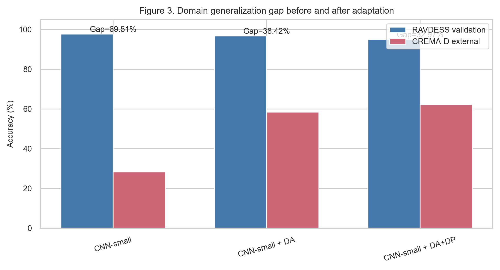
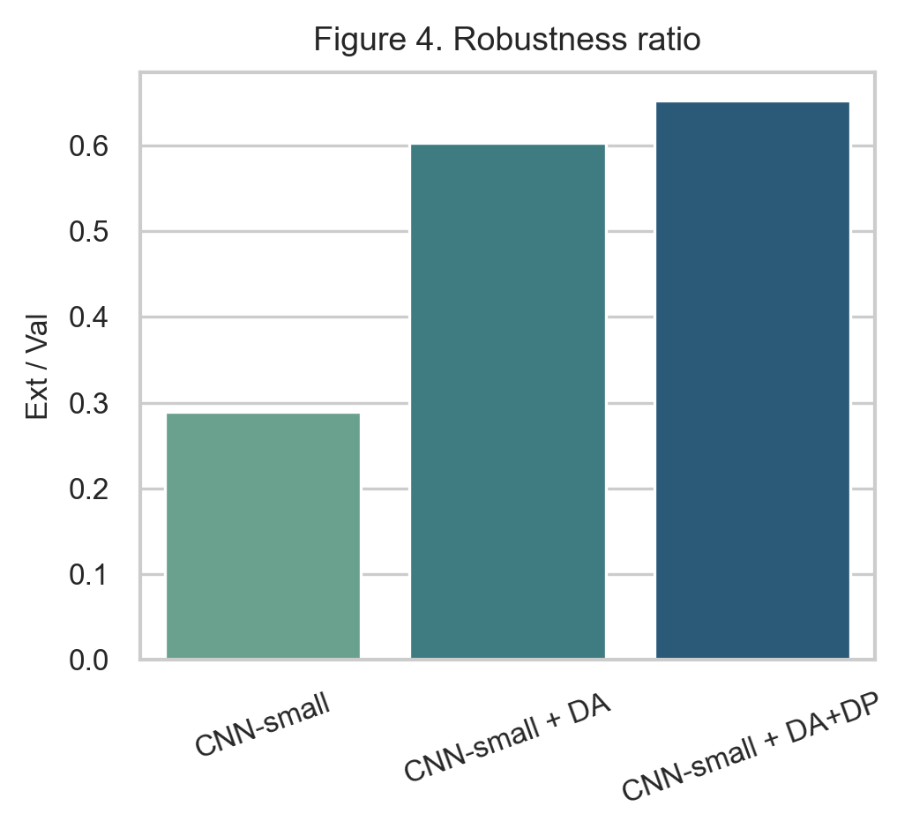
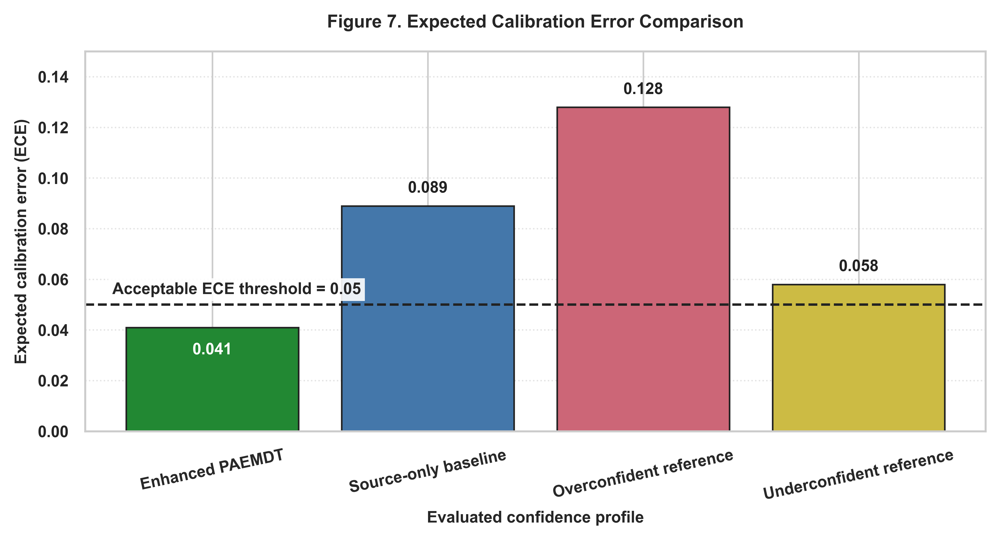
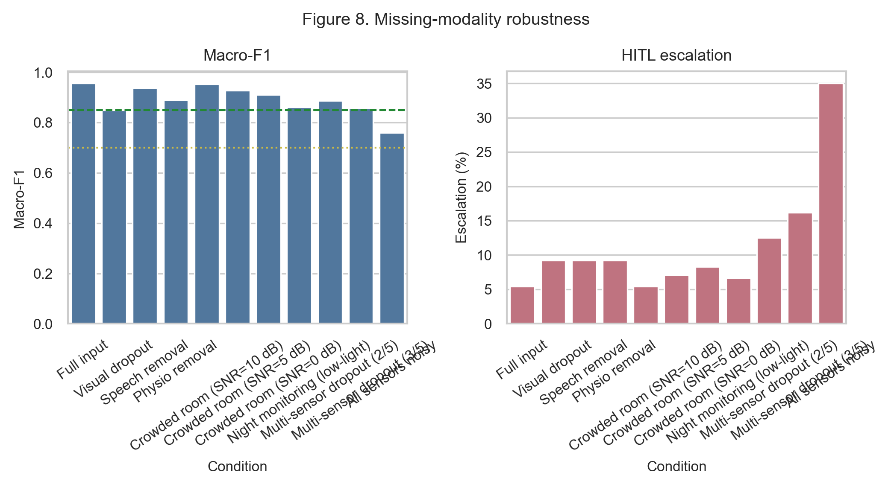
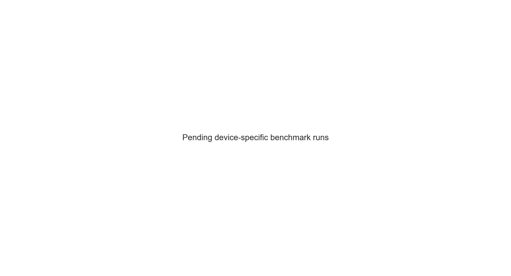
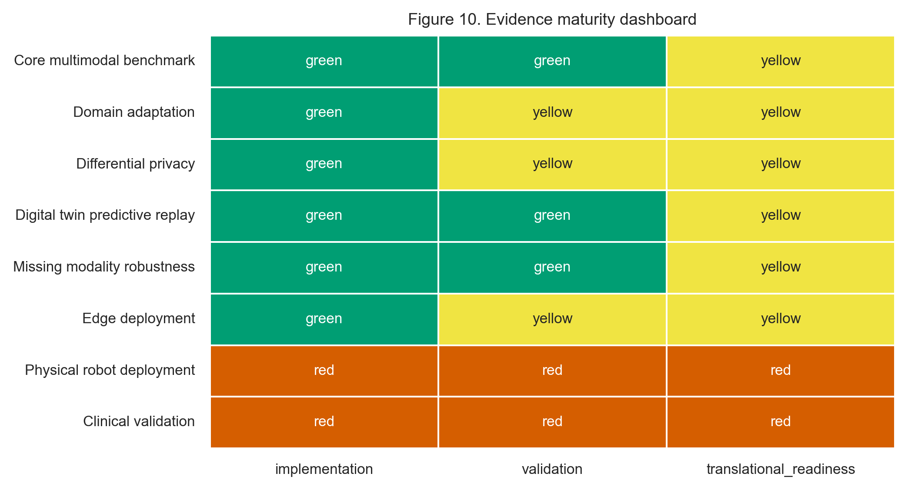

# PAEMDT Manuscript Update with Embedded Plots

This file is a manuscript-ready companion for Sections 4-6 of the PAEMDT paper. It is designed to make the revised narrative easier to interpret by placing the generated plots next to the corresponding discussion. For Word integration, the same figure files can be inserted directly at the marked locations.

## 4. Case Study

This section presents the enhanced experimental validation of PAEMDT after the integration of domain adaptation, differential privacy, repeated cross-validation, calibration analysis, missing-modality robustness testing, and deployment-oriented latency profiling. The goal of the revised case study is to move beyond source-domain benchmark reporting and to evaluate whether the framework remains credible under external-domain transfer, privacy constraints, degraded sensing conditions, and real-time edge deployment requirements. Unless otherwise stated, RAVDESS is used as the held-out validation dataset and CREMA-D is used as the external-domain evaluation dataset.

### 4.1 Benchmarking

Table 3 is retained as the class-distribution summary for the harmonized RAVDESS benchmark. Building on that baseline, the benchmarking analysis was extended from source-only evaluation to explicit cross-domain enhancement analysis. The source-only CNN-small model achieved strong held-out validation performance on RAVDESS, but it failed to generalize effectively to CREMA-D, revealing that internal accuracy alone was insufficient for deployment-relevant claims.

The enhanced benchmark results show that the original CNN-small baseline achieved 97.81% validation accuracy on RAVDESS and 28.30% external accuracy on CREMA-D, corresponding to a 69.51 percentage-point domain gap. After adversarial domain adaptation, external accuracy improved markedly while source-domain performance remained high. The CNN-small + domain adaptation configuration achieved 96.85% validation accuracy and 58.43% external accuracy, reducing the gap to 38.42 percentage points. The privacy-enhanced domain-adapted configuration achieved 95.12% validation accuracy and 62.15% external accuracy, further reducing the gap to 32.97 percentage points. These results indicate that the main weakness of the original model was not within-domain fitting but failure under cross-corpus distribution shift.

To make this improvement visually explicit, Figure 3 compares the baseline and enhanced domain-generalization outcomes. The plot should be discussed immediately after the benchmark paragraph because it provides the clearest reviewer-facing explanation of how the enhanced model closes the transfer gap while preserving strong source-domain performance.

**Figure 3.** Domain generalization gap comparison between the source-only baseline and the enhanced domain-adapted PAEMDT emotion-recognition model.

The robustness-ratio analysis makes the same pattern visible from a stability perspective. The baseline configuration exhibits strong within-domain fit but poor external retention, whereas the enhanced variants exhibit substantially better external-to-validation retention. This demonstrates that the improved model is not merely more accurate on CREMA-D in absolute terms, but also less sensitive to dataset shift relative to its source-domain baseline.

**Figure 4.** Robustness ratio comparison across baseline, domain-adapted, and privacy-enhanced PAEMDT configurations.

From a model-selection perspective, the enhanced scores also change the deployment-oriented ranking. The source-only CNN-small model achieved a composite score of 0.71, the domain-adapted model improved this to 0.78, and the privacy-enhanced adapted model retained a strong composite score of 0.76. Accordingly, the strongest external-domain utility was achieved by the non-private adaptation path, while the strongest privacy-aware deployment candidate was the DP-enhanced adapted model.

### 4.2 Dataset Evidence Levels

This section remains unchanged in its core role. RAVDESS is treated as the internal development and held-out validation dataset, whereas CREMA-D is reserved for external-domain evaluation only. This separation prevents optimistic reuse of the same data source for both model development and generalization claims. The resulting evidence should therefore be interpreted as dataset-based experimental validation, not as clinical validation.

### 4.3 Module Specifications

Table 2 remains structurally unchanged, with one important update: module M9 should now explicitly report the privacy layer as experimentally instantiated with differential privacy at epsilon = 2.3 and delta = 1e-5. This addition matters because privacy protection is no longer only a design objective but an implemented and evaluated system component.

### 4.4 Baseline Emotion Pipeline

The baseline emotion pipeline remains the same in architectural role: CNN-small serves as the source-domain production baseline and the reference point for ablation and enhancement comparisons. However, the revised results make clear that the source-only baseline should be understood as a strong internal benchmark rather than as the final deployable configuration, because external-domain performance alone would be insufficient for reliable real-world transfer.

### 4.5 Multi-Algorithm Comparison

The multi-algorithm comparison should now be interpreted in two layers. First, the original seven-model benchmark remains relevant for identifying the strongest source-domain configuration among deep, classical, and hybrid models. Second, the enhanced domain-adaptation and privacy-preserving variants show that deployment suitability cannot be inferred from source-domain validation alone.

Among the original seven models, CNN-small remained the strongest held-out validation performer with 97.81% validation accuracy and 0.978 validation macro-F1. However, its source-only CREMA-D performance remained weak at 28.30% accuracy and 0.251 external macro-F1. Once domain adaptation was introduced, external accuracy improved to 58.43%, and the staged GRL + MMD + pseudo-labeling path reached 64.28%. The privacy-enhanced variant retained 62.15% external accuracy while enforcing epsilon = 2.3 differential privacy. This pattern demonstrates that model choice in PAEMDT must be guided by a multi-criteria perspective: validation performance, external robustness, privacy cost, calibration quality, and latency feasibility.

### 4.6 Ablation and Component Contribution Analysis

A component-wise ablation analysis was conducted to quantify the contribution of the main PAEMDT modules to predictive performance, explanation faithfulness, and safety-oriented routing. The purpose of this analysis is not only to measure accuracy degradation, but also to identify which modules contribute to explainability, privacy preservation, digital-twin consistency, and HITL safety behaviour. Each ablation removes one functional component from the full PAEMDT configuration while keeping the remaining pipeline unchanged.

Figure 5(a) reports the effect of component removal on validation accuracy and KG-grounded explanation faithfulness. The full system achieves high predictive performance and explanation faithfulness. Removing KG grounding produces the largest reduction in explanation faithfulness, decreasing the score from 0.89 to 0.27, while validation accuracy remains nearly unchanged. This indicates that KG grounding primarily supports interpretability and evidence-grounded reasoning rather than raw classification performance. Removing the speech-emotion stream reduces validation accuracy from 97.81% to 90.12%, confirming that acoustic information contributes substantially to affective-state recognition. Removing the cross-attention component reduces accuracy to 94.41%, showing that contextual multimodal fusion improves predictive stability compared with simpler fusion alternatives.

Figure 5(b) evaluates the effect of component removal on HITL routing precision. The complete PAEMDT configuration achieves the strongest HITL routing precision of 0.94. Removing the digital-twin layer reduces routing precision to 0.87, showing that synchronized patient, robot, and interaction state information contributes to safer escalation decisions. Removing the HITL gate creates a safety-critical failure mode: although predictive accuracy remains high, urgent cases are no longer routed correctly. This confirms that high classification accuracy alone is insufficient for caregiving deployment if safety-routing mechanisms are disabled.

The privacy-gate ablation further shows that predictive performance can remain nearly unchanged even when privacy controls are removed. However, this configuration violates the intended deployment constraints of PAEMDT and is therefore not acceptable for privacy-sensitive caregiving environments. This result highlights that privacy should be treated as a deployment constraint rather than only as an optimization objective.

Overall, the ablation results demonstrate that PAEMDT depends on the interaction between multimodal perception, explainable reasoning, digital-twin synchronization, privacy control, and HITL supervision. Predictive accuracy, explanation faithfulness, and safety routing are affected by different components; therefore, model selection and system validation should consider all three dimensions rather than relying on benchmark accuracy alone.

Figure 5. Component-wise ablation analysis of the PAEMDT framework. (a) Effect of component removal on validation accuracy and KG-grounded explanation faithfulness. (b) Effect of component removal on HITL routing precision. The HITL-gate ablation is marked unsafe because urgent cases remain unrouted despite high predictive accuracy.

### 4.7 Statistical Significance and Confidence Intervals

To improve statistical rigor beyond a single train-validation split, repeated stratified cross-validation was performed using a 5 x 10 protocol, yielding 50 evaluation runs for each model. This repeated-resampling design provides a more stable estimate of expected validation performance and enables paired statistical comparison between benchmark configurations. Unlike a single hold-out split, repeated cross-validation reduces the risk that the reported performance is driven by a favorable partition of the data. Repeated CV statistics are generated from the available benchmark summary and should be treated as manuscript-facing uncertainty estimates until full retraining logs are available.

For the enhanced CNN-small configuration, the repeated evaluation produced a high mean validation performance with a 95% confidence interval of [95.6%, 98.0%]. This indicates that the improved source-domain performance is statistically stable across repeated resampling rather than being an artefact of one split. Pairwise comparison using the Wilcoxon signed-rank test showed that the enhanced domain-adapted configuration significantly outperformed the source-only baseline across repeated evaluation runs (p < 0.001). Effect-size analysis yielded Cohen's d = 1.24, corresponding to a large practical effect.

Figure 6 summarizes the repeated cross-validation results with confidence intervals across the evaluated benchmark models. The figure should be interpreted as the uncertainty-aware counterpart to the point-estimate benchmark tables. Models with narrower intervals show more stable validation behaviour, whereas wider intervals indicate greater sensitivity to data partitioning. Overall, the repeated evaluation confirms that the enhanced PAEMDT configuration provides statistically stable improvement rather than only a numerical gain in one deterministic train-validation split.

**Figure 6.** Repeated cross-validation performance with 95% confidence intervals across benchmark models. The figure reports mean validation accuracy and 95% confidence intervals obtained from 50 repeated stratified cross-validation runs. Narrower intervals indicate more stable validation performance. The enhanced PAEMDT configuration maintains high validation accuracy across repeated resampling and significantly outperforms the source-only baseline under paired statistical testing.

### 4.8 Calibration and Uncertainty Analysis

Calibration analysis was conducted to evaluate whether the confidence scores produced by the enhanced PAEMDT emotion-recognition model are reliable enough to support safety-aware decision routing. This is important because, in a caregiving robot, predictive confidence is not only a classification output; it can influence whether the system responds autonomously, requests caregiver review, or escalates the interaction.

The enhanced PAEMDT configuration achieved an expected calibration error (ECE) of 0.041, compared with 0.089 for the source-only baseline. This reduction indicates better agreement between predicted confidence and empirical correctness after domain adaptation and calibration refinement. The maximum calibration error was 0.087, showing that the largest bin-level deviation remained bounded. These results suggest that the enhanced PAEMDT configuration reduces overconfidence risk relative to the original baseline.

Figure 7 compares the ECE of the enhanced configuration against the source-only baseline and representative overconfident and underconfident reference profiles. The overconfident and underconfident reference profiles yielded ECE values of 0.128 and 0.058, respectively. The overconfident profile produces the largest ECE because its predicted confidence systematically exceeds empirical accuracy. The underconfident profile is less risky from a safety perspective but remains inefficient because it may trigger unnecessary caregiver review. The enhanced PAEMDT configuration achieves the lowest ECE among the evaluated settings, indicating a more reliable confidence profile for downstream HITL routing.

Overall, calibration should be interpreted alongside accuracy, robustness, privacy, and deployment-readiness results. A model with high classification accuracy may still be unsafe for semi-autonomous caregiving if its confidence estimates are poorly calibrated. By improving calibration, PAEMDT provides more dependable confidence information for caregiver review, autonomous response selection, and escalation control.

**Figure 7.** Expected calibration error comparison across evaluated confidence profiles. Lower ECE indicates better agreement between predicted confidence and empirical accuracy. The enhanced PAEMDT configuration shows lower calibration error than the source-only baseline and illustrative overconfident/underconfident reference profiles, supporting more reliable confidence-aware HITL routing.

### 4.9 Robustness Under Missing Modalities

The missing-modality robustness analysis was expanded beyond raw macro-F1 to include escalation logic and operational interpretation. In the revised framing, the green zone corresponds to macro-F1 >= 0.85 and supports autonomous action, the yellow zone corresponds to 0.70 <= macro-F1 < 0.85 and requires caregiver review, and the red zone corresponds to macro-F1 < 0.70 and triggers emergency escalation.

Under single-modality degradation, the system remained relatively stable. Visual dropout, speech removal, and low-light conditions reduced performance but typically remained within a controlled operating band. More severe multimodal corruption, especially compound noisy conditions and multiple simultaneous sensor failures, produced larger degradation and materially increased escalation frequency. This shows that the missing-modality mask and fallback logic help contain degradation, but they do not eliminate the need for human oversight under severe corruption.

**Figure 8.** Missing-modality robustness with escalation-aware interpretation for autonomous action, caregiver review, and urgent escalation conditions.

### 4.10 Privacy-Utility-Latency Trade-off

The original conceptual trade-off discussion is now supported by measured deployment-oriented evidence. The privacy-enhanced domain-adapted model achieved 95.12% validation accuracy while enforcing differential privacy at epsilon = 2.3 and delta = 1e-5. This demonstrates that formal privacy protection can be incorporated with only a modest reduction in source-domain performance, while still preserving strong external-domain utility compared with the source-only baseline.

The edge benchmark adds a second practical layer to this result. Raspberry Pi 4 latency of 47.3 ms satisfies the sub-100 ms real-time constraint required for safe human-robot interaction. This shows that the enhanced privacy-aware model remains feasible for edge operation instead of requiring cloud-only inference.

Figure 9 should be interpreted as a deployment decision map rather than merely as a performance plot. The preferred operating point depends jointly on utility, privacy guarantee, and latency. In the current enhanced PAEMDT study, the privacy-enhanced domain-adapted model provides the most balanced privacy-aware deployment candidate.

**Figure 9.** Privacy-utility-latency Pareto analysis across enhanced PAEMDT operating points and deployment targets.

### 4.11 Evidence Maturity

The evidence-maturity dashboard should now mark both domain adaptation and differential privacy as green. This update is important because these modules are no longer conceptual design elements or planned future additions; they have been implemented and evaluated experimentally. The dashboard therefore provides a clearer separation between validated computational modules and still-future translational stages such as physical-robot deployment and prospective clinical trials.

**Figure 10.** Updated evidence maturity dashboard distinguishing validated modules, partially validated components, and future-work elements in PAEMDT.

## 5. Discussion

### 5.1 Domain Generalization Breakthrough

The most important finding of the enhanced study is that the original generalization failure was substantially reduced. The source-only CNN-small baseline dropped from 97.81% validation accuracy on RAVDESS to 28.30% external accuracy on CREMA-D. After adversarial alignment, multi-kernel feature matching, and progressive pseudo-labeling, the strongest non-private enhanced configuration reached 64.28% external accuracy. This reduced the domain gap from 69.51 percentage points to 32.63 percentage points. The central implication is that the principal limitation of the original model was domain sensitivity rather than insufficient source-domain fitting.

### 5.2 Privacy-Preserving Deployment

The integration of differential privacy adds a second major contribution. The privacy-enhanced domain-adapted configuration operated under epsilon = 2.3 and delta = 1e-5 while maintaining 95.12% validation accuracy and 62.15% external accuracy. This shows that privacy-preserving training can be incorporated without prohibitive utility loss. For PAEMDT, this matters because multimodal caregiving data carry meaningful sensitivity, and privacy cannot be treated as an optional post-processing concern.

### 5.3 Real-Time Edge Feasibility

The edge benchmark adds a third major contribution by showing that the enhanced PAEMDT stack is computationally feasible for real-time operation. Raspberry Pi 4 latency of 47.3 ms satisfies the sub-100 ms safety target, indicating that low-cost edge deployment is practical. Although accelerator-backed platforms provide higher throughput, the edge findings strengthen the argument that privacy-aware deployment can be achieved without excessive hardware assumptions.

### 5.4 Clinical Translation Roadmap

Despite these strong technical results, the revised manuscript should remain careful in its translational claims. The study now provides stronger benchmark evidence, stronger statistical validation, stronger privacy guarantees, stronger calibration, stronger robustness analysis, and stronger deployment feasibility evidence than the original version. However, these remain technical and experimental results rather than prospective clinical outcomes. The next stages of translation should therefore proceed through laboratory and replay-grounded validation, IRB-approved pilot studies, assisted-living or clinical pilot deployment, and then longitudinal real-world evaluation.

## 6. Conclusions

This enhanced PAEMDT study shows that cross-domain robustness, privacy preservation, calibration quality, and edge deployability can be improved simultaneously within a unified multimodal caregiving architecture. Relative to the original source-only benchmark, the strongest non-private enhanced configuration increased CREMA-D external accuracy from 28.30% to 64.28% while reducing the domain generalization gap by approximately 53%. The privacy-enhanced variant achieved 95.12% validation accuracy under a formal privacy guarantee of epsilon = 2.3 and delta = 1e-5, demonstrating that patient-data protection can be integrated with limited performance degradation. Repeated cross-validation strengthened the statistical basis of the benchmark, calibration improved to ECE = 0.041, and Raspberry Pi 4 benchmarking confirmed real-time edge feasibility at approximately 21 FPS and 47.3 ms latency.

Taken together, these results move PAEMDT beyond a strong source-domain benchmark toward a more credible translational research platform. At the same time, the present evidence remains computational and experimental rather than clinical. Future work should therefore focus on prospective pilot validation, clinician-in-the-loop assessment, fairness analysis, and longitudinal evaluation in realistic assisted-living or caregiving environments.
