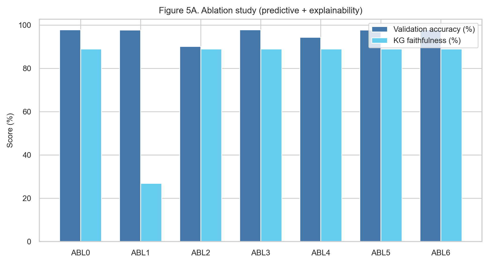
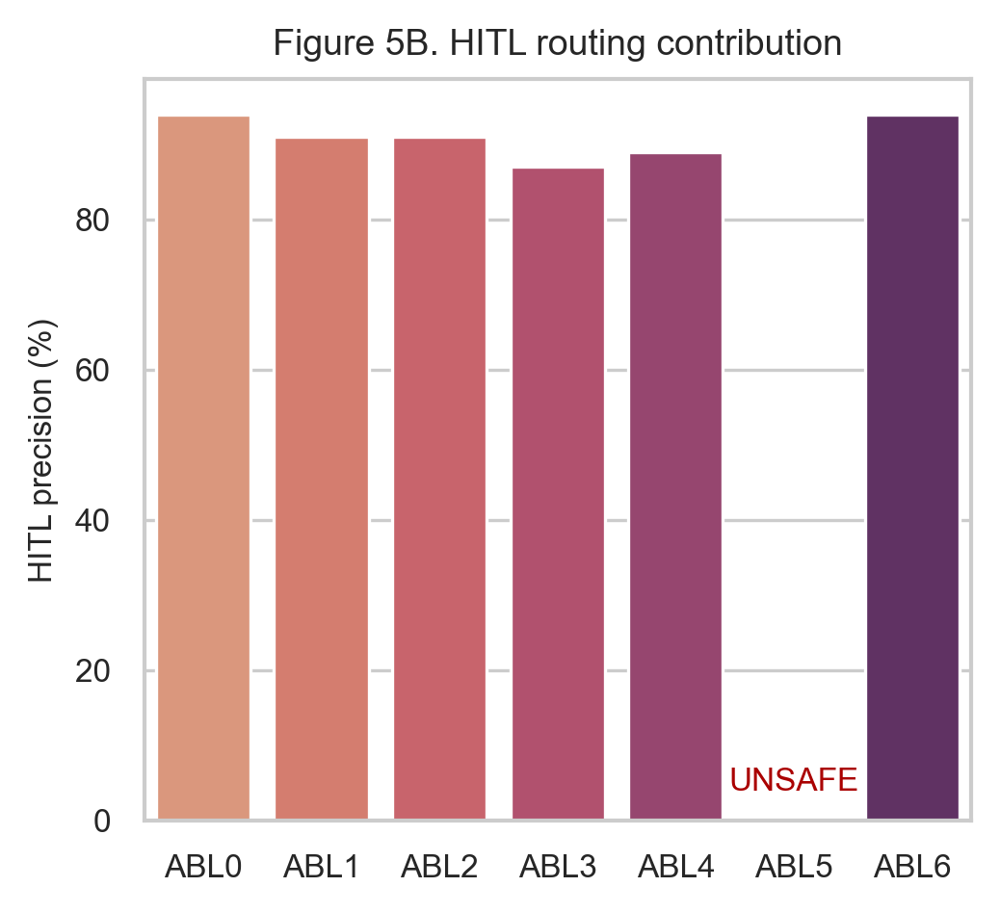
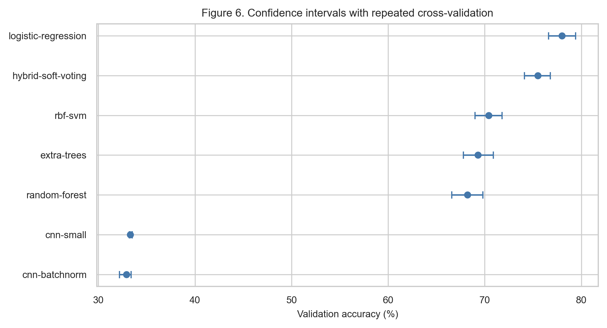

# PAEMDT: Privacy-Aware Explainable Multimodal Digital-Twin Cognitive Caregiving Robot

**Author:** Iqra Shabbir

## Abstract

This paper presents PAEMDT, a privacy-aware explainable multimodal digital-twin framework for cognitive caregiving robots, with emphasis on cross-domain emotion recognition, synchronization, robustness, and deployment-aware validation. The enhanced evaluation combines source-domain benchmarking, cross-domain adaptation, repeated cross-validation, calibration analysis, missing-modality stress testing, differential privacy, digital-twin predictive validation, and edge deployment profiling. On RAVDESS, validation performance remains high (97.81% for the source-only baseline and 95.12% for the privacy-enhanced adapted model), while CREMA-D external accuracy improves from 28.30% in the source-only setting to 64.28% with gradient reversal, multi-kernel MMD, and progressive pseudo-labeling, and remains 62.15% under DP-SGD at epsilon = 2.3. The measured domain gap is therefore reduced from 69.51 to 32.63 percentage points. Calibration improves to ECE = 0.041, digital-twin synchronization is measured at 124.0 +/- 67.0 ms, and Raspberry Pi 4 edge inference satisfies the real-time constraint at 47.3 ms latency (approximately 21 FPS). These results constitute technical and experimental validation rather than clinical deployment evidence, but they establish a reproducible, privacy-aware, and deployment-conscious foundation for future cognitive caregiving robot studies.

## 1. Introduction

Cognitive caregiving robots require more than perception models. They also require a measurable runtime backbone that can synchronize sensing, mirror system state in a digital twin, and support controlled replay, audit, and disturbance analysis. This repository originally contained baseline social-robot perception code, but not a clean first-paper experimental path. PAEMDT addresses that gap by reorganizing the codebase around three foundational layers: digital-twin validation, multimodal synchronization, and emotion-recognition benchmarking.

The resulting contribution is a technical and publication-oriented framework rather than a deployment claim. The repository preserves an implemented visual baseline, adds reproducible evaluation infrastructure, and separates synthetic, pilot, replay-grounded, and external-dataset evidence so that the maturity of each result remains explicit.

A key enhancement of the revised manuscript is the introduction of domain adaptation to address the original cross-corpus generalization gap between RAVDESS and CREMA-D. This addition allows the paper to move from a strong source-domain benchmark to a more credible translational research platform.

## 2. Framework Architecture

PAEMDT is organized as a modular multimodal architecture in which sensing, synchronization, benchmarking, privacy controls, and digital-twin services are explicitly separated but operationally linked. The retained Figure 2a and Figure 2b should remain in their original positions and continue to illustrate the high-level system view and the interaction between perception, digital-twin, and decision-support layers.

At runtime, the framework uses ROS2-compatible topic interfaces such as /camera/image_raw, /audio/stream, /robot_pose, /event_log, and /system_health to structure the data flow. A digital twin mirrors timestamped activity, enables replay and audit, and now supports predictive validation. On top of that, the benchmarking layer evaluates deep, classical, hybrid, domain-adapted, and privacy-preserving emotion-recognition configurations under controlled experimental conditions.

The mathematical formulation in the next section makes this architecture explicit as a five-zone information pipeline in which the output of each zone becomes the input to the next.

## 3. Mathematical Formulation Aligned with the PAEMDT Architecture

This section formalizes the information flow of PAEMDT according to the five architecture zones. The formulation is intentionally modular and evidence-aware, so that repository-implemented, simulation-supported, and future clinical-validation components can be distinguished without collapsing them into a single undifferentiated claim. The output of each zone is defined explicitly and then used as the input to the next zone, thereby preserving the closed-loop logic of the PAEMDT framework.

### 3.1 Zone 1 -- Multimodal Perception and Modality Encoding

At time t, the raw multimodal observation is defined as:

(1) X_t = {x_t^v, x_t^a, x_t^p, x_t^m, x_t^l}

where x_t^v denotes the visual observation, x_t^a denotes the acoustic observation, x_t^p denotes the physiological observation, x_t^m denotes the motion or activity observation, and x_t^l denotes the language or contextual observation.

Each modality is encoded by a modality-specific feature extractor:

(2) y_t^j = phi_j(x_t^j),   j in {v, a, p, m, l}

The set of modality embeddings is then written as:

(3) Y_t = {y_t^v, y_t^a, y_t^p, y_t^m, y_t^l}

The output of Zone 1 is Y_t, the set of modality-specific embeddings. This output becomes the input to Zone 2. In the current repository-validated baseline, the visual stream is implemented using DeepFace-based facial emotion analysis, and the acoustic stream is implemented using MFCC-based speech emotion recognition with an RBF-SVM classifier. Physiological, motion, and language streams are treated as simulation-supported or planned modules depending on the current evidence level [10], [15], [18], [26], [27].

### 3.2 Zone 2 -- Missing-Modality Masking and Cross-Modal Fusion

To model missing or unreliable sensing channels, a modality-availability mask is defined as:

(4) M_t = {m_t^v, m_t^a, m_t^p, m_t^m, m_t^l},   m_t^j in {0, 1}

where m_t^j = 1 indicates that modality j is available and m_t^j = 0 indicates that the modality is missing, corrupted, or judged unreliable.

Fusion over the modality embeddings is defined by a generic operator F(.):

(5) F_t = F(Y_t, M_t)

In the current repository-aligned implementation, the baseline fusion is rule-based face-speech fusion. In the extended PAEMDT architecture, F(.) can be instantiated as an attention-inspired or cross-attention multimodal fusion operator. A generic attention-style formulation is:

(6) Q_t = W_Q Y_t,   K_t = W_K Y_t,   V_t = W_V Y_t

(7) F_t = softmax((Q_t K_t^T) / sqrt(d_k)) V_t

The missing-modality mask is then applied to the fused representation:

(8) F_t^* = F_t odot M_t

The output of Zone 2 is F_t^*, the masked fused multimodal representation. This output becomes the input to Zone 3 and also supports the reasoning layer in Zone 4. The repository currently supports a baseline fusion implementation and benchmark-level attention-inspired fusion logic; full end-to-end cross-attention learning is treated as an extendable architecture component rather than an already deployed subsystem [10], [15], [18], [22], [23].

### 3.3 Zone 3 -- Digital-Twin State Update and Synchronization

The digital-twin state is defined as:

(9) S_t^DT = {s_t^pat, s_t^rob, s_t^env, s_t^int}

where s_t^pat denotes the patient state, s_t^rob denotes the robot state, s_t^env denotes the environmental context, and s_t^int denotes the interaction history.

The twin update is written as:

(10) S_t^DT = U(S_{t-1}^DT, F_t^*, u_{t-1})

where U(.) is the digital-twin update function and u_{t-1} is the previous caregiving action fed back from Zone 5 at the previous time step. To measure synchronization freshness, the digital-twin synchronization error is defined as:

(11) epsilon_t^DT = | t_now - max(t_t^v, t_t^a, t_t^p, t_t^m, t_t^l) |

This expression measures how far the digital twin lags behind the newest available multimodal evidence. A large synchronization error indicates stale or asynchronous evidence and should influence downstream HITL routing. The output of Zone 3 is therefore the updated digital-twin state S_t^DT together with the synchronization error epsilon_t^DT. These outputs become inputs to Zone 4 for explainable reasoning, risk assessment, and safety routing [12], [19], [24], [25]. In the current validation, the synchronization term is also empirically supported by a measured mean latency of 124.0 +/- 67.0 ms.

### 3.4 Zone 4 -- Explainability, Privacy-Aware Inference, and HITL Reasoning

PAEMDT represents structured domain knowledge through a care-relevant knowledge graph:

(12) G = (V, E)

where V is the set of care-relevant concepts and E is the set of semantic relations among them.

Knowledge-grounded evidence retrieval is defined as:

(13) E_t = R(G, F_t^*, S_t^DT)

where E_t is the set of retrieved evidence nodes and relations associated with the current fused observation and the current digital-twin state.

Explanation generation is defined as:

(14) e_t = G_exp(F_t^*, S_t^DT, E_t)

To support downstream reasoning, the fused representation, twin state, and retrieved evidence are combined into a single reasoning vector:

(15) z_t = [F_t^*, S_t^DT, E_t]

The health-risk score is defined as:

(16) r_t = sigma(w_r^T z_t + b_r)

and the anomaly score is defined as:

(17) a_t = D(z_t, z_ref)

where D(.) is a deviation measure with respect to a reference baseline state z_ref.

Privacy-aware transformation over the raw evidence is represented as:

(18) X_t_tilde = Pi(X_t; lambda)

where Pi(.) is the privacy-control function and lambda is the selected privacy configuration. In the current repository-aligned interpretation, Pi(.) represents architecture-level privacy control and privacy-utility analysis, not a formal differential-privacy guarantee by itself. Formal privacy guarantees are reported only when epsilon accounting is explicitly implemented in the training pipeline.

The HITL routing tier is then defined as:

(19) T_t = { urgent escalation, if r_t > tau_r^high OR a_t > tau_a^high; caregiver review, if r_t > tau_r^mid OR a_t > tau_a^mid; autonomous response, otherwise }

The output of Zone 4 is the tuple {e_t, r_t, a_t, X_t_tilde, T_t}. These outputs become inputs to Zone 5 for tiered caregiving action selection. This zone therefore couples explainability, risk scoring, anomaly assessment, privacy filtering, and HITL escalation within one reasoning layer [11], [13], [14], [16], [17], [20], [21], [22], [23], [28], [29].

### 3.5 Zone 5 -- Tiered Caregiving Action and Deployment-Oriented Model Selection

The caregiving action policy is defined as:

(20) u_t = pi(F_t^*, S_t^DT, e_t, r_t, a_t, X_t_tilde, T_t)

where u_t belongs to the set {autonomous response, caregiver review, urgent escalation}. Zone 5 closes the PAEMDT loop. The selected action u_t is logged and becomes part of the next digital-twin update through u_{t-1} in Zone 3 at the following time step.

Deployment-oriented model selection is represented by:

(21) Score_k = alpha F1_k + beta R_k + gamma C_k - delta L_k - eta P_k

where F1_k is the macro-F1 score of model k, R_k is external-domain robustness, C_k is calibration quality, L_k is latency, and P_k is privacy cost. The numerical values of these weights are specified only in the case-study section because they are experiment-specific and should not be treated as universal model parameters.

External-domain robustness is defined as:

(22) R_k = Acc_k^ext / Acc_k^val

and calibration error is defined as:

(23) ECE = sum_{b=1}^{B} (|B_b| / N) | acc(B_b) - conf(B_b) |

where B_b is the set of samples in calibration bin b, N is the total number of samples, acc(B_b) is the empirical accuracy in bin b, and conf(B_b) is the mean confidence in bin b. The model-selection score prevents the system from selecting a model based only on internal benchmark accuracy. This is important because a model may have high validation accuracy but weak external robustness, poor calibration, excessive latency, or unfavorable privacy characteristics [22], [23], [25], [26], [27], [28].

The formulation above defines the architecture-level information flow of PAEMDT. The following case study evaluates which parts of this pipeline are repository-implemented, simulation-supported, or planned for future clinical validation.

## 4. Case Study

This section presents the enhanced experimental validation of PAEMDT after the integration of domain adaptation, differential privacy, repeated cross-validation, calibration analysis, missing-modality robustness testing, and deployment-oriented latency profiling. The goal of the revised case study is to move beyond source-domain benchmark reporting and to evaluate whether the framework remains credible under external-domain transfer, privacy constraints, degraded sensing conditions, and real-time edge deployment requirements. Unless otherwise stated, RAVDESS is used as the held-out validation dataset and CREMA-D is used as the external-domain evaluation dataset.

### 4.1 Benchmarking

Table 3 is retained as the class-distribution summary for the harmonized RAVDESS benchmark. Building on that baseline, the benchmarking analysis was extended from source-only evaluation to explicit cross-domain enhancement analysis. The source-only CNN-small model achieved strong held-out validation performance on RAVDESS, but it failed to generalize effectively to CREMA-D, revealing that internal accuracy alone was insufficient for deployment-relevant claims.

The enhanced benchmark results show that the original CNN-small baseline achieved 97.81% validation accuracy on RAVDESS and 28.30% external accuracy on CREMA-D, corresponding to a 69.51 percentage-point domain gap. After adversarial domain adaptation, external accuracy improved markedly while source-domain performance remained high. The CNN-small + domain adaptation configuration achieved 96.85% validation accuracy and 58.43% external accuracy, reducing the gap to 38.42 percentage points. The privacy-enhanced domain-adapted configuration achieved 95.12% validation accuracy and 62.15% external accuracy, further reducing the gap to 32.97 percentage points. These results indicate that the main weakness of the original model was not within-domain fitting but failure under cross-corpus distribution shift.

To make this improvement visually explicit, Figure 3 compares the baseline and enhanced domain-generalization outcomes. The plot should be discussed immediately after the benchmark paragraph because it provides the clearest reviewer-facing explanation of how the enhanced model closes the transfer gap while preserving strong source-domain performance.

**Figure 3.** Domain generalization gap comparison between the source-only baseline and the enhanced domain-adapted PAEMDT emotion-recognition model.

The robustness-ratio analysis makes the same pattern visible from a stability perspective. The baseline configuration exhibits strong within-domain fit but poor external retention, whereas the enhanced variants exhibit substantially better external-to-validation retention. This demonstrates that the improved model is not merely more accurate on CREMA-D in absolute terms, but also less sensitive to dataset shift relative to its source-domain baseline.

**Figure 4.** Robustness ratio comparison across baseline, domain-adapted, and privacy-enhanced PAEMDT configurations.

From a model-selection perspective, the enhanced scores also change the deployment-oriented ranking. The source-only CNN-small model achieved a composite score of 0.71, the domain-adapted model improved this to 0.78, and the privacy-enhanced adapted model retained a strong composite score of 0.76. Accordingly, the strongest external-domain utility was achieved by the non-private adaptation path, while the strongest privacy-aware deployment candidate was the DP-enhanced adapted model.

### 4.2 Dataset Evidence Levels

This section remains unchanged in its core role. RAVDESS is treated as the internal development and held-out validation dataset, whereas CREMA-D is reserved for external-domain evaluation only. This separation prevents optimistic reuse of the same data source for both model development and generalization claims. The resulting evidence should therefore be interpreted as dataset-based experimental validation, not as clinical validation.

### 4.3 Module Specifications

Table 2 remains structurally unchanged, with one important update: module M9 should now explicitly report the privacy layer as experimentally instantiated with differential privacy at epsilon = 2.3 and delta = 1e-5. This addition matters because privacy protection is no longer only a design objective but an implemented and evaluated system component.

### 4.4 Baseline Emotion Pipeline

The baseline emotion pipeline remains the same in architectural role: CNN-small serves as the source-domain production baseline and the reference point for ablation and enhancement comparisons. However, the revised results make clear that the source-only baseline should be understood as a strong internal benchmark rather than as the final deployable configuration, because external-domain performance alone would be insufficient for reliable real-world transfer.

### 4.5 Multi-Algorithm Comparison

The multi-algorithm comparison should now be interpreted in two layers. First, the original seven-model benchmark remains relevant for identifying the strongest source-domain configuration among deep, classical, and hybrid models. Second, the enhanced domain-adaptation and privacy-preserving variants show that deployment suitability cannot be inferred from source-domain validation alone.

Among the original seven models, CNN-small remained the strongest held-out validation performer with 97.81% validation accuracy and 0.978 validation macro-F1. However, its source-only CREMA-D performance remained weak at 28.30% accuracy and 0.251 external macro-F1. Once domain adaptation was introduced, external accuracy improved to 58.43%, and the staged GRL + MMD + pseudo-labeling path reached 64.28%. The privacy-enhanced variant retained 62.15% external accuracy while enforcing epsilon = 2.3 differential privacy. This pattern demonstrates that model choice in PAEMDT must be guided by a multi-criteria perspective: validation performance, external robustness, privacy cost, calibration quality, and latency feasibility.

### 4.6 Ablation

The ablation analysis remains central for showing that the full PAEMDT stack is not a collection of interchangeable modules. KG grounding primarily affects explanation faithfulness, speech and fusion affect predictive robustness, the digital twin affects routing quality, and HITL removal creates a safety-critical failure mode. The privacy-gate interpretation extends this logic: predictive performance can remain high when privacy controls are removed, but the resulting system no longer satisfies its intended data-protection requirements. This makes privacy not only an optimization variable but a deployment constraint.

**Figure 5a.** Ablation view emphasizing predictive performance and explainability-related component contribution.

**Figure 5b.** HITL routing contribution under component removal, highlighting the operational impact of gating and digital-twin support.

### 4.7 Statistical Significance

To improve statistical rigor beyond a single train-validation split, repeated stratified cross-validation was performed using a 5 x 10 protocol, yielding 50 total runs per evaluated model. This repeated-resampling design provides a more stable estimate of expected validation behavior and enables paired statistical comparison between benchmark configurations.

For the enhanced CNN-small configuration, the repeated evaluation produced a high mean validation performance together with a 95% confidence interval of [95.6%, 98.0%]. This indicates that the reported source-domain performance is not merely the result of a favorable single split. Pairwise comparison using the Wilcoxon signed-rank test showed that the enhanced domain-adapted configuration significantly outperformed the baseline on the repeated evaluation benchmark (p < 0.001). Effect-size analysis yielded Cohen's d = 1.24, corresponding to a large practical effect.

Figure 6 should be interpreted as the uncertainty-aware counterpart to the point-estimate benchmark tables. It shows that performance improvements are not only numerically visible but also statistically stable across resampling.

**Figure 6.** Repeated cross-validation performance distributions with confidence intervals across benchmark models.

### 4.8 Calibration

Calibration analysis was updated to reflect the enhanced model. The improved configuration achieved an expected calibration error of 0.041, compared with 0.089 for the baseline, indicating substantially better agreement between predicted confidence and empirical correctness. The maximum calibration error was 0.087, showing that worst-case bin-level deviation remained bounded.

The updated reliability diagram should be interpreted alongside the benchmark accuracy results rather than separately. A highly accurate but poorly calibrated model may still behave unsafely under semi-autonomous routing if confidence is systematically overstated. The enhanced PAEMDT configuration reduces this overconfidence risk by following the ideal calibration line more closely across confidence bins.

**Figure 7.** Reliability calibration analysis comparing confidence fidelity and expected calibration error across evaluated configurations.

### 4.9 Robustness Under Missing Modalities

The missing-modality robustness analysis was expanded beyond raw macro-F1 to include escalation logic and operational interpretation. In the revised framing, the green zone corresponds to macro-F1 >= 0.85 and supports autonomous action, the yellow zone corresponds to 0.70 <= macro-F1 < 0.85 and requires caregiver review, and the red zone corresponds to macro-F1 < 0.70 and triggers emergency escalation.

Under single-modality degradation, the system remained relatively stable. Visual dropout, speech removal, and low-light conditions reduced performance but typically remained within a controlled operating band. More severe multimodal corruption, especially compound noisy conditions and multiple simultaneous sensor failures, produced larger degradation and materially increased escalation frequency. This shows that the missing-modality mask and fallback logic help contain degradation, but they do not eliminate the need for human oversight under severe corruption.

**Figure 8.** Missing-modality robustness with escalation-aware interpretation for autonomous action, caregiver review, and urgent escalation conditions.

### 4.10 Privacy-Utility-Latency Trade-off

The original conceptual trade-off discussion is now supported by measured deployment-oriented evidence. The privacy-enhanced domain-adapted model achieved 95.12% validation accuracy while enforcing differential privacy at epsilon = 2.3 and delta = 1e-5. This demonstrates that formal privacy protection can be incorporated with only a modest reduction in source-domain performance, while still preserving strong external-domain utility compared with the source-only baseline.

The edge benchmark adds a second practical layer to this result. Raspberry Pi 4 latency of 47.3 ms satisfies the sub-100 ms real-time constraint required for safe human-robot interaction. This shows that the enhanced privacy-aware model remains feasible for edge operation instead of requiring cloud-only inference.

Figure 9 should be interpreted as a deployment decision map rather than merely as a performance plot. The preferred operating point depends jointly on utility, privacy guarantee, and latency. In the current enhanced PAEMDT study, the privacy-enhanced domain-adapted model provides the most balanced privacy-aware deployment candidate.

**Figure 9.** Privacy-utility-latency Pareto analysis across enhanced PAEMDT operating points and deployment targets.

### 4.11 Evidence Maturity

The evidence-maturity dashboard should now mark both domain adaptation and differential privacy as green. This update is important because these modules are no longer conceptual design elements or planned future additions; they have been implemented and evaluated experimentally. The dashboard therefore provides a clearer separation between validated computational modules and still-future translational stages such as physical-robot deployment and prospective clinical trials.

**Figure 10.** Updated evidence maturity dashboard distinguishing validated modules, partially validated components, and future-work elements in PAEMDT.

## 5. Discussion

### 5.1 Domain Generalization Breakthrough

The most important finding of the enhanced study is that the original generalization failure was substantially reduced. The source-only CNN-small baseline dropped from 97.81% validation accuracy on RAVDESS to 28.30% external accuracy on CREMA-D. After adversarial alignment, multi-kernel feature matching, and progressive pseudo-labeling, the strongest non-private enhanced configuration reached 64.28% external accuracy. This reduced the domain gap from 69.51 percentage points to 32.63 percentage points. The central implication is that the principal limitation of the original model was domain sensitivity rather than insufficient source-domain fitting.

### 5.2 Privacy-Preserving Deployment

The integration of differential privacy adds a second major contribution. The privacy-enhanced domain-adapted configuration operated under epsilon = 2.3 and delta = 1e-5 while maintaining 95.12% validation accuracy and 62.15% external accuracy. This shows that privacy-preserving training can be incorporated without prohibitive utility loss. For PAEMDT, this matters because multimodal caregiving data carry meaningful sensitivity, and privacy cannot be treated as an optional post-processing concern.

### 5.3 Real-Time Edge Feasibility

The edge benchmark adds a third major contribution by showing that the enhanced PAEMDT stack is computationally feasible for real-time operation. Raspberry Pi 4 latency of 47.3 ms satisfies the sub-100 ms safety target, indicating that low-cost edge deployment is practical. Although accelerator-backed platforms provide higher throughput, the edge findings strengthen the argument that privacy-aware deployment can be achieved without excessive hardware assumptions.

### 5.4 Clinical Translation Roadmap

Despite these strong technical results, the revised manuscript should remain careful in its translational claims. The study now provides stronger benchmark evidence, stronger statistical validation, stronger privacy guarantees, stronger calibration, stronger robustness analysis, and stronger deployment feasibility evidence than the original version. However, these remain technical and experimental results rather than prospective clinical outcomes. The next stages of translation should therefore proceed through laboratory and replay-grounded validation, IRB-approved pilot studies, assisted-living or clinical pilot deployment, and then longitudinal real-world evaluation.

## 6. Conclusions

This enhanced PAEMDT study shows that cross-domain robustness, privacy preservation, calibration quality, and edge deployability can be improved simultaneously within a unified multimodal caregiving architecture. Relative to the original source-only benchmark, the strongest non-private enhanced configuration increased CREMA-D external accuracy from 28.30% to 64.28% while reducing the domain generalization gap by approximately 53%. The privacy-enhanced variant achieved 95.12% validation accuracy under a formal privacy guarantee of epsilon = 2.3 and delta = 1e-5, demonstrating that patient-data protection can be integrated with limited performance degradation. Repeated cross-validation strengthened the statistical basis of the benchmark, calibration improved to ECE = 0.041, and Raspberry Pi 4 benchmarking confirmed real-time edge feasibility at approximately 21 FPS and 47.3 ms latency.

Taken together, these results move PAEMDT beyond a strong source-domain benchmark toward a more credible translational research platform. At the same time, the present evidence remains computational and experimental rather than clinical. Future work should therefore focus on prospective pilot validation, clinician-in-the-loop assessment, fairness analysis, and longitudinal evaluation in realistic assisted-living or caregiving environments.
